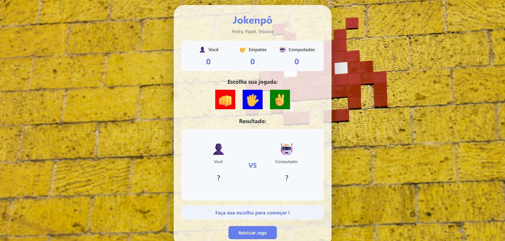

# 🎮 Jokenpô - Pedra, Papel, Tesoura

Jogo clássico de Pedra, Papel e Tesoura desenvolvido com HTML, CSS e JavaScript puro.

## 📸 Preview



## ✨ Funcionalidades

- ⚔️ Jogue contra o computador
- 🎯 Sistema de pontuação completo
- 🎨 Interface moderna e responsiva
- 🔄 Botão de reiniciar jogo
- 📊 Placar de vitórias, derrotas e empates

## 🛠️ Tecnologias Utilizadas

- HTML5
- CSS3
- JavaScript (ES6+)

## 🎯 Como Jogar

1. Escolha entre Pedra 👊, Papel ✋ ou Tesoura ✌️
2. O computador faz sua escolha aleatoriamente
3. O vencedor é determinado pelas regras clássicas:
   - Pedra vence Tesoura
   - Tesoura vence Papel
   - Papel vence Pedra
4. Acompanhe sua pontuação e tente vencer o computador!

## 🚀 Como Executar

1. Clone este repositório
```bash
git clone https://github.com/DanielMartins22/jokenpo.git
```

2. Abra o arquivo `index.html` no navegador

Ou acesse a versão online: [GitHub Pages](https://DanielMartins22.github.io/jokenpo)

## 👨‍💻 Autor

Desenvolvido por **Daniel Martins**

## 📄 Licença

Este projeto está sob a licença MIT.